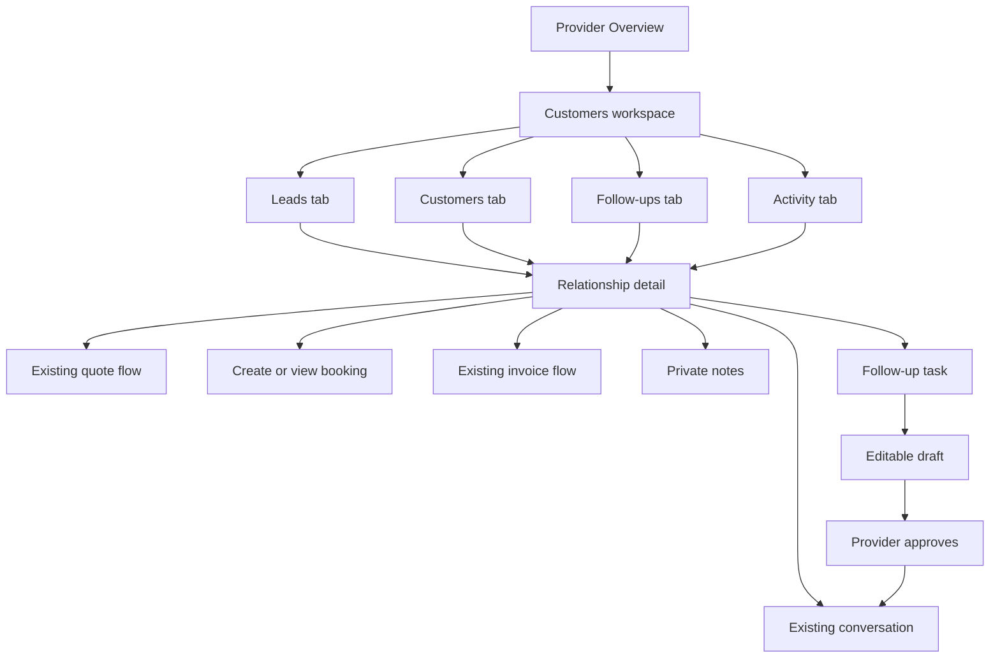

# OlogyCrew Provider Customers Experience

## User Flows and Responsive Wireframe Specification

**Status:** Product and interaction specification; no live routes or navigation have been changed  
**Author:** Manus AI  
**Date:** September 2026  

> Providers do not wake up wanting to “use a CRM.” They want to know **who needs a response, who needs a quote, and who may be ready to book again**.

## 1. Experience Principles

The user-facing feature is named **Customers**, not CRM. It extends the approved provider workspace and automatically organizes existing OlogyCrew activity. Providers should not re-enter customer, booking, quote, invoice, or message information that the platform already knows.[1] Manual work is limited to private notes, follow-up tasks, stage overrides, communication preferences, and approving relationship messages.

| Principle | Interface consequence |
|---|---|
| Action before analysis | The first content is “Needs follow-up,” not a dashboard of charts. |
| Automatic history | Quotes, bookings, payments, invoices, messages, and booking-linked reviews populate the timeline. |
| Customer ownership | Every screen says “Your customer relationship” and shows only that provider’s interactions. |
| Human-approved outreach | Rebooking and relationship messages open as editable drafts; no automatic marketing blast. |
| Transactional continuity | Message, quote, booking, invoice, and public-service actions deep-link to existing OlogyCrew flows. |
| Low cognitive load | One primary route, four plain-language tabs, three summary cards maximum, and one clear next action per row. |
| Privacy by design | Private notes are visibly marked “Only you can see this.” Admin aggregate reporting does not surface their contents. |

## 2. Information Architecture

The proposed route is `/provider/customers`. It becomes a first-class provider workspace destination rather than a tile or separate application.

### Desktop navigation

Insert **Customers** after **Bookings** in the approved provider sidebar:

`Overview → Bookings → Customers → Services → Calendar → Money → My Page → More`

### Mobile navigation

Use the five-item mobile bar:

`Home → Bookings → Customers → Money → More`

Calendar remains available through **More**, the Overview “Block time” action, and booking pages. This gives the relationship layer direct mobile access without increasing bottom-navigation density.

### Customers workspace tabs

| Tab | Purpose |
|---|---|
| **Leads** | People with a quote, inquiry, or booking request who have not yet completed a booking. |
| **Customers** | People with booked or completed OlogyCrew work, including repeat and dormant filters. |
| **Follow-ups** | Open, due, snoozed, and completed provider tasks and recommended drafts. |
| **Activity** | Provider-wide chronological relationship events with filters. |

The active tab must be represented in the URL, such as `/provider/customers?tab=follow-ups`, so links from Overview, notifications, and email return to the correct state.

## 3. Core Navigation Map



## 4. Provider Entry Points

The feature should appear where providers already make relationship decisions.

| Entry point | Label and behavior |
|---|---|
| Provider sidebar/mobile bar | **Customers** opens the last-used Customers tab. |
| Overview Needs attention | “Quote for Jordan needs a response” opens the relationship detail with the quote event focused. |
| Overview Business pulse | The Customers metric becomes clickable and opens the Customers tab. |
| Booking detail | Customer name opens the relationship detail. |
| Quote detail | “View relationship” opens the lead/customer detail without losing the quote action. |
| Conversation header | “Customer history” opens the relationship detail in a new route state. |
| Invoice detail | Customer name opens relationship detail; invoice remains authoritative. |
| Notification | Follow-up recommendation opens the specific task and relationship. |

## 5. First-Visit and Empty-State Flow

When the provider opens Customers for the first time, the platform silently derives eligible relationships from existing activity. The screen must not imply that the provider must import a spreadsheet or rebuild past work.

### No relationships

The empty state reads:

> **Your customer relationships will build automatically.** When someone requests a quote, books a service, or starts an eligible conversation, OlogyCrew will organize the history here.

Primary action: **Share your page**. Secondary action: **Add a service**. A helper note states that only OlogyCrew customer activity appears in Release 1.

### Relationships exist but no actions are due

Show the relationship list and a compact success state:

> **You’re caught up.** No customer follow-ups need attention right now.

Do not hide the list or replace the page with a congratulatory illustration.

## 6. Desktop Wireframe: Leads Tab

```text
┌ Provider sidebar ┐  ┌──────────────────────────────────────────────────────────┐
│ Overview         │  │ Customers                                   [+ Add task] │
│ Bookings         │  │ Relationships built from your OlogyCrew activity          │
│ Customers  ●     │  ├──────────────────────────────────────────────────────────┤
│ Services         │  │ Leads | Customers | Follow-ups | Activity                 │
│ Calendar         │  ├──────────────────────────────────────────────────────────┤
│ Money            │  │ [New leads 3] [Need response 2] [Quotes expiring 1]       │
│ My Page          │  ├──────────────────────────────────────────────────────────┤
│ More             │  │ [Search name, email, service] [Stage ▾] [Newest ▾]        │
└──────────────────┘  ├──────────────────────────────────────────────────────────┤
                      │ Needs attention                                            │
                      │ ● Jordan Lee   Quote requested   3h ago   [Review request] │
                      │   Church audio · Oct 18 · Atlanta                          │
                      │                                                           │
                      │ ○ Casey M.     Quote sent        2d ago   [Follow up]      │
                      │   Mobile detailing · expires tomorrow                     │
                      ├──────────────────────────────────────────────────────────┤
                      │ All leads                                                  │
                      │ Name         Stage      Last activity      Next action      │
                      │ Jordan Lee   New lead   Quote · 3h ago     Review request → │
                      │ Casey M.     Quoted     Quote · 2d ago     Follow up →      │
                      └──────────────────────────────────────────────────────────┘
```

The three summary cards are counts, not vanity metrics. Selecting one applies the matching filter. “Needs attention” contains at most five rows; the full list follows below. Rows use a single primary action and allow keyboard activation.

## 7. Desktop Wireframe: Customers Tab

```text
┌───────────────────────────────────────────────────────────────────────────────┐
│ Customers                                                                    │
│ [Search customers]  [All stages ▾] [All services ▾] [Last activity ▾]        │
├───────────────────────────────────────────────────────────────────────────────┤
│ Customer      Relationship       Completed   Captured value   Next / Last     │
│ John Smith    Repeat customer    4           $1,280           No next booking  │
│               Last activity Aug 25                              [View]          │
│                                                                               │
│ Priya N.      Customer           1           $240             Oct 12, 2:00 PM  │
│               Last activity Sep 4                               [View]          │
└───────────────────────────────────────────────────────────────────────────────┘
```

Default sort is **Needs attention, then most recent activity**. Captured value is labeled explicitly and never includes unpaid booking totals, failed payments, or unreconciled refunds. Providers may filter by Lead, Quoted, Booked, Customer, Repeat, Dormant, and Archived.

## 8. Relationship Detail: Centerpiece Screen

The relationship detail is the centerpiece requested in the owner-provided strategy. It uses route `/provider/customers/:contactId` and derives its identity from the authenticated provider scope, not a provider ID in the URL.

### Desktop layout

```text
┌───────────────────────────────────────────────────────────────────────────────┐
│ ← Customers   John Smith                         [Message] [Book] [More ▾]     │
│ Repeat customer · Customer since Mar 2026 · Last active Aug 25                │
├───────────────────────────────────────────────────────────────────────────────┤
│ [4 completed bookings] [$1,280 captured value] [No upcoming booking]          │
├──────────────────────────────────────────────┬────────────────────────────────┤
│ Recommended next action                      │ Relationship                    │
│ John has no future booking.                  │ Stage: Repeat customer [Auto]   │
│ Last completed: Audio Engineering · Aug 21  │ Preferred: Email                │
│ [Create follow-up] [Dismiss]                 │ Relationship email: Allowed     │
├──────────────────────────────────────────────┤ [Manage preference]             │
│ Activity                                     ├────────────────────────────────┤
│ Aug 25  Message received                    │ Private notes                   │
│ Aug 23  Invoice paid · $450                 │ “Prefers Saturday appointments.”│
│ Aug 22  Booking-linked review received      │ [Add note]                      │
│ Aug 21  Audio Engineering completed · $450  │ Only you can see these notes.   │
│ [Load earlier activity]                      ├────────────────────────────────┤
│                                              │ Open follow-ups                 │
│                                              │ Check upcoming fall events      │
│                                              │ Due Sep 5 [Complete] [Snooze]   │
└──────────────────────────────────────────────┴────────────────────────────────┘
```

### Header actions

**Message** deep-links to the existing authorized conversation or creates one only when the current relationship permits it.[6] **Book** opens the existing provider-assisted booking path with the customer and prior service context prefilled. **More** contains Send quote, Create invoice when entitled, Archive relationship, Export this relationship when entitled, and Return stage to automatic.

### Timeline behavior

Timeline entries use factual source labels: Quote requested, Quote sent, Booking confirmed, Service completed, Payment captured, Invoice paid, Message received, and Booking-linked review received. Clicking an event opens the source detail. Message events show “Message sent/received” and a short safe preview only if existing message authorization permits it; full bodies remain in Messages.

## 9. Mobile Wireframes

### 9.1 Customers home

```text
┌──────────────────────────────┐
│ Customers          Search 🔍 │
│ Who needs attention today?   │
├──────────────────────────────┤
│ Leads Customers Follow-ups › │  horizontal tabs
├──────────────────────────────┤
│ Need response            2   │
│ Follow-ups due           3   │
│ Repeat customers        12   │
├──────────────────────────────┤
│ NEEDS ATTENTION              │
│ Jordan Lee                   │
│ Quote requested · 3h ago     │
│ Church audio · Oct 18        │
│ [Review request]             │
├──────────────────────────────┤
│ Casey M.                     │
│ Quote expires tomorrow       │
│ [Create follow-up]           │
├──────────────────────────────┤
│ Home Bookings Customers ...  │  fixed bottom navigation
└──────────────────────────────┘
```

Summary counts become one compact stacked panel rather than three side-by-side cards. The tab strip scrolls horizontally and announces the active tab. Filters open a bottom sheet with Apply and Clear actions.

### 9.2 Relationship detail

```text
┌──────────────────────────────┐
│ ← Customers      More ⋯      │
│ John Smith                   │
│ Repeat customer · Auto       │
├──────────────────────────────┤
│ 4 jobs  ·  $1,280 captured   │
│ No upcoming booking          │
├──────────────────────────────┤
│ RECOMMENDED                  │
│ No booking in 90 days        │
│ [Create follow-up] [Dismiss] │
├──────────────────────────────┤
│ Activity | Notes | Follow-ups│
│ Aug 25 Message received      │
│ Aug 23 Invoice paid · $450   │
│ Aug 21 Service completed     │
├──────────────────────────────┤
│ [Message]       [Create ▴]   │  sticky action bar
└──────────────────────────────┘
```

The **Create** menu offers Booking, Quote, Invoice when entitled, Task, and Note. The sticky action bar must remain above the existing mobile navigation and safe-area inset.

## 10. Exact User Flows

### Flow A: New quote lead to booked customer

| Step | Provider experience | System behavior |
|---|---|---|
| 1 | Provider receives the existing quote notification. | Creates/updates the scoped contact, appends `quote.requested`, derives `lead`, and creates one deduplicated reply task. |
| 2 | Provider opens the notification and lands on the relationship detail with quote context. | Marks the recommendation viewed; quote remains authoritative. |
| 3 | Provider selects **Review request**, prepares the existing quote, and sends it. | Appends `quote.sent`, derives `quoted`, completes the reply task, and may create a delayed follow-up task. |
| 4 | Customer accepts the quote. | Appends `quote.accepted`; contact stays `quoted` until booking creation. |
| 5 | Quote converts to booking. | Appends `quote.booked` and `booking.created`; derives `booked`. |
| 6 | Service completes. | Appends `booking.completed`, recalculates captured value, derives `customer`, and later evaluates rebooking eligibility. |

### Flow B: Direct booking creates a relationship automatically

The provider receives a booking exactly as today. OlogyCrew creates the contact and timeline in the background. Opening the customer name from the booking shows the relationship detail. The provider does not complete a CRM setup form.

### Flow C: Recommended rebooking follow-up

| Step | Provider experience | System behavior |
|---|---|---|
| 1 | Follow-ups shows “John has no future booking.” | Daily deterministic evaluation finds an eligible completed customer and creates one task using a dedupe key. |
| 2 | Provider selects **Create message**. | Opens an editable in-app draft with the prior service context; no message is sent. |
| 3 | Provider edits and selects **Send**. | Rechecks authorization and communication preferences, then calls the existing message service. |
| 4 | Provider dismisses instead. | Records dismissal and removes the task from due views; it is not recreated within the suppression window. |

### Flow D: Private note

Provider selects **Add note**, sees “Only you can see this,” enters up to 5,000 characters, and saves. The note appears in the relationship panel and provider-visible timeline. It is excluded from admin summaries, customer APIs, exports unless the provider requests their scoped export, and all automated message drafts.

### Flow E: Manual follow-up task

Provider selects **Add task**, enters a title, optional note, due date/time, and priority, then saves. The task appears in Follow-ups and the relationship detail. Completing, snoozing, dismissing, and reopening are optimistic UI actions with rollback on failure.

### Flow F: Manual stage override

Provider changes the stage and chooses a reason. The UI displays “Manual stage” and offers **Return to automatic stage**. New transactions continue updating the hidden derived stage but do not silently erase the override.

### Flow G: Do not contact

Provider opens communication preference and selects **Do not contact** with an optional operational note. All relationship drafts become unsendable, open recommendation tasks display the preference, and future rules may create internal tasks but not sendable drafts. A customer’s platform-wide opt-out always takes precedence.

### Flow H: Archive and restore

Archiving removes the relationship from default views but preserves factual transaction history. New inbound activity automatically restores visibility and prompts the provider to confirm whether the manual archive should remain.

## 11. Loading, Empty, Error, and Locked States

| State | Required experience |
|---|---|
| Initial loading | Skeleton rows shaped like the list; global page navigation remains usable. |
| Empty leads | “No open leads. New quote requests and inquiries will appear automatically.” |
| Empty customers | “Completed and upcoming OlogyCrew customers will appear here.” |
| Empty follow-ups | “You’re caught up. No relationship tasks are due.” |
| Search with no results | Preserve filters and offer **Clear filters**; never imply the customer does not exist globally. |
| Recoverable API failure | Explain that no data changed, retain the last rendered list when possible, and provide **Try again**. |
| Unauthorized relationship | Return a not-found experience rather than revealing that another provider has that customer. |
| Feature locked | Show read-only automatic history when allowed and one standardized plan comparison action; do not scatter multiple upgrade banners. |
| Communication blocked | Explain the customer’s preference without exposing private preference history; disable Send and allow task completion/dismissal. |
| Projection delayed | Show source transactions normally and a subtle “Relationship summary updating” state; never block booking or messaging. |

## 12. Accessibility and Interaction Requirements

All tabs use semantic tab roles and keyboard navigation. List rows remain operable without relying on hover. Stage colors always include text labels. Task completion has an undo window. Dialog focus is trapped and restored. Mobile targets are at least 44 pixels. Timeline events use headings and ordered-list semantics. Captured-value labels include currency, while dates and times render in the provider’s local timezone.

## 13. Analytics Instrumentation

| Event | Purpose |
|---|---|
| `crm_customers_opened` | Adoption by eligible provider and plan. |
| `crm_contact_opened` | Relationship-detail usage. |
| `crm_task_created`, `completed`, `snoozed`, `dismissed` | Workflow value and recommendation quality. |
| `crm_draft_opened`, `edited`, `sent`, `dismissed` | Human-approval funnel. |
| `crm_source_action_opened` | Whether CRM helps providers reach quote, booking, message, and invoice actions. |
| `crm_stage_overridden`, `override_cleared` | Accuracy of deterministic stages. |
| `crm_rebook_conversion` | Completed booking attributed to an approved CRM follow-up. |

Instrumentation must use identifiers and categorical metadata, not note bodies or message content.

## 14. Release-1 Usability Acceptance

A first-time provider with historical OlogyCrew activity must understand the Customers page without setup. In usability testing, the provider should be able to find a new lead, open the complete relationship history, add a private note, create and complete a task, open an editable rebooking draft, and locate an existing booking or message without instructions. No relationship message may be sent without a deliberate provider action.

## 15. References

[1]: [Current OlogyCrew platform schema](../../drizzle/schema.ts)  
[2]: [Approved provider Overview workspace](../../client/src/pages/ProviderWorkspaceOverview.tsx)  
[3]: [Provider dashboard booking, quote, customer, and analytics tools](../../client/src/pages/ProviderDashboard.tsx)  
[4]: [Existing provider analytics helpers](../../server/db/analytics.ts)  
[5]: [Existing secure messaging router](../../server/routers/messageRouter.ts)  
[6]: [Authoritative provider entitlement model](../../shared/entitlements.ts)
