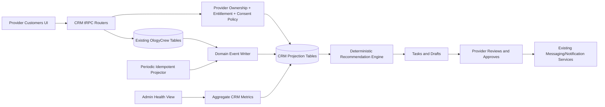

# OlogyCrew Native Customer Relationship Layer

## Technical Architecture and Database Schema

**Status:** Proposed architecture; no application behavior or database schema has been changed  
**Author:** Manus AI  
**Date:** September 2026  

> **Product framing:** The booking is the transaction. The Customer Relationship layer manages what happens before, between, and after transactions.

## 1. Architectural Decision

OlogyCrew should build a **native provider-owned Customer Relationship layer**, not a general-purpose CRM and not a separate product. The first release should convert existing marketplace activity into a useful customer history with minimal manual maintenance. Providers should see only customers who have a legitimate relationship with their business through an OlogyCrew quote, booking, invoice, or conversation. Platform administrators should see aggregate provider-health and lifecycle signals, not provider-private notes.

The current platform already stores the authoritative identity, provider, service, booking, payment, review, message, quote, invoice, notification, subscription, and audit records required to derive most CRM value.[1] The CRM therefore becomes a **relationship projection** over existing data rather than a second source of truth.

| Design decision | Required behavior |
|---|---|
| Product name | Use **Customers** in provider navigation and user-facing copy. Reserve “CRM” for internal architecture and planning. |
| Ownership | Each relationship belongs to one provider and one OlogyCrew customer. It is never a platform-wide customer list exposed to providers. |
| Source of truth | Bookings, quotes, payments, invoices, messages, and reviews remain authoritative. CRM summaries and stages are derived projections. |
| Automation | Transactional communication remains automatic. Relationship communication begins as a recommended task and editable draft requiring provider approval. |
| Administration | Admin sees aggregate provider health and automation operations. Private provider notes are excluded from normal admin APIs and screens. |
| AI | AI is not required for Release 1. Deterministic rules create recommendations. AI summarization and drafting may be added later behind explicit provider action and cost controls. |

## 2. Existing Capabilities to Reuse

OlogyCrew’s current provider Overview already prioritizes **Needs attention**, **Today**, **Quick actions**, and **Business pulse**, including customer and returning-customer counts.[2] The CRM should extend that approved workspace rather than recreate the removed tile launchpad.

| Existing capability | Authoritative source | CRM use |
|---|---|---|
| User identity and communication details | `users` | Display customer name and currently permitted contact channels; never duplicate passwords, OAuth identifiers, or security data. |
| Provider ownership | `service_providers` | Tenant boundary for every contact, task, note, event, rule, and draft. |
| Lead and quote lifecycle | `quote_requests` | Derive lead, quote-sent, accepted, declined, expired, and booked events. |
| Booking lifecycle | `bookings`, `booking_sessions` | Derive booked, upcoming, completed, cancelled, no-show, repeat-customer, and rebooking signals. |
| Revenue | `payments`, `invoices` | Calculate captured lifetime value and open/overdue invoice actions without treating unpaid totals as revenue. |
| Communication | `messages` | Deep-link to the existing secure conversation. Timeline stores message metadata, not full message bodies. |
| Reputation provenance | `reviews` | Show booking-linked review events only; never create or infer reviews. |
| Communication consent | `notification_preferences` | Respect global channel and marketing settings. Provider-specific relationship preferences add a narrower deny/allow layer. |
| Provider plan access | `shared/entitlements.ts` | Add explicit CRM capabilities and enforce them at API boundaries, never with client-only hiding.[5] |
| Auditability | `audit_log` | Record support break-glass access, rule changes, exports, and administrative lifecycle actions. |
| Customer rebooking | `customerHomeRouter` | Reuse the active-provider, active-service, completed-booking eligibility pattern for provider rebooking opportunities.[3] |
| Relationship analytics | `server/db/analytics.ts` | Extend existing total/returning-customer and retention calculations rather than creating a parallel analytics engine.[4] |

## 3. System Boundaries



The customer relationship layer has four internal modules. `server/db/crm/*` owns persistence and scoped queries. `server/crm/*` owns stage resolution, event projection, recommendation rules, consent evaluation, and summary recalculation. `server/crmRouter.ts` exposes provider-scoped procedures. `client/src/pages/provider/Customers*` supplies the provider interface. Existing booking, quote, invoice, payment, review, and message services remain responsible for their own domains.

## 4. Event and Projection Architecture

Every relevant state transition should create one immutable CRM event with a deterministic `eventKey`. The business mutation and event write should occur in the same database transaction whenever the affected router supports transactions. The event is projected immediately for responsive UI, while a periodic recovery job replays unprocessed events and creates time-based recommendations.

The recovery processor should use OlogyCrew’s managed HTTP scheduling mechanism, not `setInterval` or an in-process cron. A project-level job can run every five minutes for projection repair and once daily for dormant-customer recommendations. Handlers must be idempotent, process bounded batches, return useful error context, and never send relationship messages automatically.

| Event family | Representative event types | Primary source |
|---|---|---|
| Lead and quote | `quote.requested`, `quote.sent`, `quote.accepted`, `quote.declined`, `quote.expired`, `quote.booked` | `quote_requests` |
| Booking | `booking.created`, `booking.confirmed`, `booking.started`, `booking.completed`, `booking.cancelled`, `booking.no_show` | `bookings` |
| Financial | `payment.captured`, `payment.failed`, `payment.refunded`, `invoice.sent`, `invoice.viewed`, `invoice.paid`, `invoice.overdue` | `payments`, `invoices` |
| Communication | `message.sent`, `message.received`, `message.read` | `messages` |
| Reputation | `review.received`, `review.responded` | `reviews` |
| Relationship | `crm.note.created`, `crm.stage.overridden`, `crm.task.completed`, `crm.draft.sent`, `crm.preference.changed` | CRM tables |

Event payloads should contain only timeline-safe metadata such as service name, amount in cents, state, and source URL. They should not copy full message bodies, payment credentials, private booking notes, or authentication data.

## 5. Relationship and Follow-Up Model

The architecture deliberately separates **relationship stage** from **follow-up state**. A repeat customer can still require a follow-up, and a lead can have multiple open tasks. Mixing both concepts into one stage would produce unstable segmentation.

| Derived relationship stage | Deterministic rule |
|---|---|
| `lead` | Customer has an inbound quote, message, or booking request but no accepted quote or booking. |
| `quoted` | A current quote has been sent and is awaiting a customer decision. |
| `booked` | Customer has a pending, confirmed, or in-progress booking and no completed booking yet. |
| `customer` | At least one booking has completed. |
| `repeat_customer` | At least two bookings have completed. |
| `dormant` | At least one booking completed, no future booking exists, and no qualifying interaction occurred within the configured inactivity window. |
| `archived` | Provider explicitly archives the relationship; the source transaction history remains intact. |

Providers may apply a manual stage override, but the derived stage must remain stored separately and recalculated. The UI should disclose that an override exists and provide “Return to automatic stage.” **Follow-up needed** is a task/query state, not a relationship stage.

## 6. Proposed Additive Database Schema

All timestamps use UTC. Monetary summaries use integer cents. Foreign keys and indexes are shown conceptually and must be implemented with Drizzle migrations reviewed before execution.

### 6.1 `crm_contacts`

One row represents the provider-owned relationship with one existing OlogyCrew customer.

| Column | Type | Rules and purpose |
|---|---|---|
| `id` | `int` PK | Auto-incremented identifier. |
| `providerId` | `int` FK | Required tenant boundary to `service_providers.id`. |
| `customerId` | `int` FK | Required OlogyCrew user. External/manual contacts are out of Release 1. |
| `derivedStage` | enum | `lead`, `quoted`, `booked`, `customer`, `repeat_customer`, `dormant`. |
| `manualStage` | nullable enum | Same values plus `archived`; never overwrites `derivedStage`. |
| `manualStageReason` | nullable varchar(500) | Provider-entered context for an override. |
| `firstInteractionAt` | timestamp | Earliest qualifying provider/customer interaction. |
| `lastInteractionAt` | timestamp | Latest qualifying relationship event. |
| `lastBookingAt` | nullable timestamp | Latest booked service date. |
| `nextBookingAt` | nullable timestamp | Nearest future eligible booking. |
| `completedBookingCount` | int | Rebuildable projection. |
| `capturedLifetimeValueCents` | bigint | Captured payments net of recorded refunds; never unpaid booking totals. |
| `openQuoteCount` | int | Rebuildable projection. |
| `openTaskCount` | int | Rebuildable projection. |
| `lastProjectedEventId` | nullable bigint | Projection checkpoint. |
| `archivedAt` | nullable timestamp | Provider archive time. |
| `createdAt`, `updatedAt` | timestamps | Audit timestamps. |

Required indexes are unique `(providerId, customerId)`, `(providerId, derivedStage, lastInteractionAt)`, `(providerId, nextBookingAt)`, and `(providerId, openTaskCount, lastInteractionAt)`. The provider scope must be the first indexed column for list queries.

### 6.2 `crm_activity_events`

This append-only table powers the customer timeline and projection recovery.

| Column | Type | Rules and purpose |
|---|---|---|
| `id` | `bigint` PK | Monotonic event cursor. |
| `eventKey` | varchar(190) unique | Deterministic idempotency key such as `booking:123:completed`. |
| `providerId`, `customerId`, `contactId` | FK columns | Required ownership and relationship identifiers. |
| `eventType` | varchar(80) | Namespaced event type. |
| `entityType`, `entityId` | varchar/int | Source reference without copying the source record. |
| `occurredAt` | timestamp | Business event time, not projection time. |
| `summary` | varchar(500) | Safe provider-facing timeline summary. |
| `metadata` | JSON | Minimal non-sensitive fields for rendering and rules. |
| `visibility` | enum | `provider`, `customer_provider`, `system`; Release 1 UI uses provider-visible events. |
| `projectedAt` | nullable timestamp | Null means recovery processor should project it. |
| `createdAt` | timestamp | Insert time. |

Required indexes are unique `eventKey`, `(providerId, occurredAt)`, `(contactId, occurredAt)`, and `(projectedAt, id)`.

### 6.3 `crm_contact_notes`

| Column | Type | Rules and purpose |
|---|---|---|
| `id`, `contactId`, `providerId`, `authorUserId` | IDs | Provider scope is repeated intentionally for authorization and efficient deletion. |
| `body` | text | Plain text or sanitized Markdown; 5,000-character limit. |
| `visibility` | enum | Release 1 permits only `provider_private`. |
| `createdAt`, `updatedAt`, `deletedAt` | timestamps | Soft deletion preserves an audit trail without showing removed text. |

Indexes are `(contactId, createdAt)` and `(providerId, createdAt)`. Normal admin queries must not select this table.

### 6.4 `crm_tasks`

| Column | Type | Rules and purpose |
|---|---|---|
| `id`, `providerId`, `contactId` | IDs | `contactId` may be null only for provider-level onboarding tasks in a later release. |
| `taskType` | enum | `reply_to_lead`, `follow_up_quote`, `rebook_opportunity`, `invoice_follow_up`, `reply_to_message`, `manual`. |
| `title`, `description` | varchar/text | Provider-readable action. |
| `status` | enum | `open`, `snoozed`, `completed`, `dismissed`, `cancelled`. |
| `priority` | enum | `low`, `normal`, `high`, `urgent`; rules may not create “urgent” marketing tasks. |
| `dueAt`, `snoozedUntil` | timestamps | Drive follow-up views and reminders. |
| `sourceEventId` | nullable bigint FK | Event that created the recommendation. |
| `automationRuleId` | nullable int FK | Rule provenance. |
| `dedupeKey` | varchar(190) unique | Prevent duplicate recommendations across retries. |
| `assignedUserId` | int FK | Release 1 defaults to the provider owner; supports future staff assignment. |
| `completedAt`, `dismissedAt`, `dismissReason` | fields | Outcome and learning signals. |
| `createdAt`, `updatedAt` | timestamps | Audit timestamps. |

Indexes are `(providerId, status, dueAt)`, `(contactId, status, dueAt)`, and unique `dedupeKey`.

### 6.5 `crm_contact_stage_history`

This immutable table records derived and manual stage changes.

| Column | Type | Rules and purpose |
|---|---|---|
| `id`, `contactId`, `providerId` | IDs | Scoped history record. |
| `fromStage`, `toStage` | varchar(40) | Previous and next effective stage. |
| `source` | enum | `system`, `provider`, `backfill`, `support_break_glass`. |
| `changedByUserId` | nullable int FK | Null for system/backfill. |
| `reason` | nullable varchar(500) | Required for manual archive and support actions. |
| `createdAt` | timestamp | Immutable transition time. |

Index `(contactId, createdAt)` supports history; `(providerId, createdAt)` supports scoped audit.

### 6.6 `crm_contact_preferences`

This table narrows communication permissions for a provider/customer relationship. It does not override a customer’s platform-wide opt-out.

| Column | Type | Rules and purpose |
|---|---|---|
| `contactId` | int unique FK | One preference row per relationship. |
| `preferredChannel` | enum | `in_app`, `email`, `sms`, `none`, `unknown`. |
| `relationshipEmailAllowed`, `relationshipSmsAllowed` | booleans | Effective permission is this value **and** the global preference. Defaults false for marketing. |
| `doNotContactAt`, `doNotContactReason` | nullable fields | Prevent relationship recommendations from producing sendable drafts. |
| `source` | enum | `customer`, `provider_observed`, `system`; only customer/system may grant a marketing channel. |
| `updatedByUserId`, `updatedAt` | fields | Audit source and time. |

### 6.7 `crm_message_drafts`

| Column | Type | Rules and purpose |
|---|---|---|
| `id`, `providerId`, `contactId`, `taskId` | IDs | Draft provenance. |
| `channel` | enum | Release 1 supports `in_app`; email/SMS remain disabled for relationship marketing. |
| `subject`, `body` | fields | Editable provider draft. |
| `origin` | enum | `template`, `provider`, `ai`; Release 1 uses template/provider. |
| `status` | enum | `draft`, `approved`, `sent`, `dismissed`, `failed`. |
| `consentSnapshot` | JSON | Effective preference result at send time; never treated as permanent consent. |
| `approvedByUserId`, `approvedAt`, `sentMessageId`, `sentAt` | fields | Human approval and existing-message linkage. |
| `createdAt`, `updatedAt` | timestamps | Audit timestamps. |

Every send must re-evaluate current preferences and relationship authorization. A draft is not permission to send.

### 6.8 `crm_automation_rules` and `crm_automation_runs`

Release 1 ships platform-defined deterministic rules that a provider may enable or disable. A future release may add provider-defined schedules.

| Table | Important fields |
|---|---|
| `crm_automation_rules` | `id`, nullable `providerId`, unique `ruleKey` within scope, `triggerType`, `conditions` JSON, `delayMinutes`, `actionType`, `approvalRequired`, `isEnabled`, `version`, timestamps. |
| `crm_automation_runs` | `id`, `ruleId`, `providerId`, `contactId`, `triggerEventId`, unique `dedupeKey`, `status`, `outputTaskId`, `outputDraftId`, `errorCode`, `startedAt`, `completedAt`. |

Rules must never store arbitrary executable code. Conditions use a versioned allow-listed JSON structure validated with Zod. Relationship message actions require `approvalRequired = true`; the server should reject any attempt to disable approval for a non-transactional action.

## 7. API and Service Layout

The provider API should use protected tRPC procedures and resolve `providerId` from the authenticated user rather than accepting it from the browser.

| Router area | Procedures |
|---|---|
| `crm.contacts` | `list`, `get`, `archive`, `restore`, `setStageOverride`, `clearStageOverride` |
| `crm.timeline` | `listForContact`, `listProviderActivity` |
| `crm.notes` | `create`, `update`, `delete` |
| `crm.tasks` | `list`, `create`, `complete`, `snooze`, `dismiss`, `reopen` |
| `crm.drafts` | `createFromTask`, `update`, `approveAndSend`, `dismiss` |
| `crm.preferences` | `get`, `recordProviderObservation`; customer-facing grant/revoke procedures should live in an account privacy router |
| `crm.analytics` | `summary`, `funnel`, `retention`, `recommendationOutcomes` |
| `crm.admin` | Aggregate-only `providerHealthSummary`, `automationHealth`, and audited support access request; no standard private-note procedure |

List procedures use cursor pagination. Contact search should index normalized user names and emails through joined queries or an authorized search projection; it must not expose customers outside the provider relationship.

## 8. First Deterministic Recommendations

| Recommendation | Trigger and condition | Output | Send behavior |
|---|---|---|---|
| Reply to new lead | Quote or customer message remains unanswered for 12 hours | High-priority task | Provider acts manually. |
| Follow up on quote | Quote remains `quoted` for 48 hours and expires in more than 24 hours | Task plus editable in-app draft | Provider approval required. |
| Rebooking opportunity | Completed customer has no future booking and no recent cancellation; inactivity threshold reached | Task plus service-link draft | Provider approval required and do-not-contact respected. |
| Invoice follow-up | Provider-owned invoice becomes overdue | Task linking to invoice | Transactional invoice system remains authoritative. |
| Relationship cleanup | Quote declined/expired and no other active opportunity remains | Low-priority review task | No customer communication. |

The system should not create automatic “five-star review” requests, fabricated testimonials, cold-contact campaigns, or messages to customers who have no provider relationship.

## 9. Privacy, Security, and Compliance Boundaries

| Boundary | Enforcement |
|---|---|
| Tenant isolation | Every provider query resolves the provider from the authenticated user and includes `providerId` in database predicates. |
| Relationship eligibility | Contact creation requires an existing quote, booking, invoice, or authorized conversation involving that provider and customer. |
| Private notes | Separate table and router; excluded from admin lists, exports, analytics payloads, and activity summaries. |
| Admin access | Aggregate by default. Any future case-level support access requires a reason, elevated role, short-lived scope, and audit entry. |
| Consent | Global customer preferences always win. Provider-specific preferences may restrict but cannot expand a global opt-out. |
| Data minimization | Store source IDs and safe summaries, not full copies of messages, cards, bank data, authentication fields, or identity documents. |
| Deletion | Existing account deletion/anonymization remains authoritative. CRM notes, tasks, drafts, preferences, and projections must be included in cleanup and retention logic. |
| Exports | Provider export contains only their scoped relationship records and excludes internal rule diagnostics and other providers’ data. |
| Demo/test safety | No seeded fake contacts, reviews, or testimonials. Automated tests use hidden reserved identities and verified cleanup. |

## 10. Entitlement Model Recommendation

CRM access should be added to the shared entitlement model before any UI promise is published. Proposed new provider feature keys are `customerHistory`, `crmNotes`, `crmFollowUps`, `crmDrafts`, `crmSegments`, `crmRetentionAnalytics`, and `crmCustomAutomations`.

| Provider plan | Release access recommendation |
|---|---|
| Starter | Read-only customer list, booking/quote history, and existing messaging for OlogyCrew-originated relationships. |
| Pro | Notes, follow-up tasks, deterministic recommendations, editable drafts, relationship stages, and standard filters. |
| Business | Everything in Pro plus saved segments, retention analytics, automation controls, and future staff assignment when team accounts exist. |

Only shipped capabilities should appear in plan copy. Backend gates must call the lifecycle-aware entitlement resolver so a cancelling subscription retains paid access through its paid period and suspended access is handled consistently.[5]

## 11. Migration and Backfill Order

| Phase | Change | Safety requirement |
|---|---|---|
| 1 | Add CRM tables and indexes | Additive migration only; no alteration to existing transaction tables. |
| 2 | Backfill contacts from existing provider/customer quotes and bookings | Idempotent `(providerId, customerId)` upsert; exclude deleted/test identities. |
| 3 | Backfill safe activity events | Deterministic event keys; no message-body or payment-secret copying. |
| 4 | Recalculate contact summaries and stages | Compare sampled counts to existing provider analytics. |
| 5 | Dual-write new domain events | Feature-flagged, with metrics for write failures and projection lag. |
| 6 | Enable read-only Customers UI | Validate tenant isolation before enabling notes or tasks. |
| 7 | Enable provider writes and recommendations | Start with selected providers; relationship sending remains approval-only. |

Backfill should be restartable by cursor and bounded batches. No public provider, booking, payment, review, or discovery behavior changes during schema/backfill phases.

## 12. Observability and Testing

Required operational metrics are projection lag, unprocessed event count, duplicate-event rejection count, failed rule runs, task creation rate, provider dismissal rate, draft approval rate, unauthorized-access denials, and cleanup failures. Alerts should focus on stuck projections and security failures, not normal provider inactivity.

The implementation test matrix must cover provider tenant isolation, relationship eligibility, idempotent events, deterministic stage transitions, manual override precedence, captured-value calculations, note privacy, consent resolution, duplicate-task suppression, draft approval, existing-message authorization, entitlement transitions, deleted-account cleanup, demo/test exclusion, cursor pagination, and desktop/mobile UI states.

## 13. Recommended Project Structure

```text
shared/
  crm.ts                         # stages, features, event names, schemas
server/
  crmRouter.ts                   # provider-facing router composition
  crm/
    contactService.ts            # eligibility and contact projection
    eventService.ts              # idempotent event writes and replay
    stageResolver.ts             # pure relationship-stage rules
    recommendationEngine.ts      # deterministic allow-listed rules
    consentPolicy.ts             # global + relationship preference result
    draftService.ts              # approval and existing-message dispatch
    adminAnalytics.ts            # aggregate-only admin reporting
  db/crm/
    contacts.ts
    events.ts
    notes.ts
    tasks.ts
    drafts.ts
    preferences.ts
client/src/pages/provider/
  CustomersHome.tsx
  CustomerDetail.tsx
  FollowUps.tsx
  CustomerActivity.tsx
```

This structure keeps routers small, pure rules testable, and domain writes separate from UI formatting.

## 14. References

[1]: [OlogyCrew Drizzle schema](../../drizzle/schema.ts)  
[2]: [Approved provider Overview workspace](../../client/src/pages/ProviderWorkspaceOverview.tsx)  
[3]: [Customer rebooking and action feed implementation](../../server/customerHomeRouter.ts)  
[4]: [Provider and customer analytics helpers](../../server/db/analytics.ts)  
[5]: [Authoritative shared entitlement model](../../shared/entitlements.ts)  
[6]: [Secure messaging router](../../server/routers/messageRouter.ts)  
[7]: [Quote lifecycle repository](../../server/db/quotes.ts)
